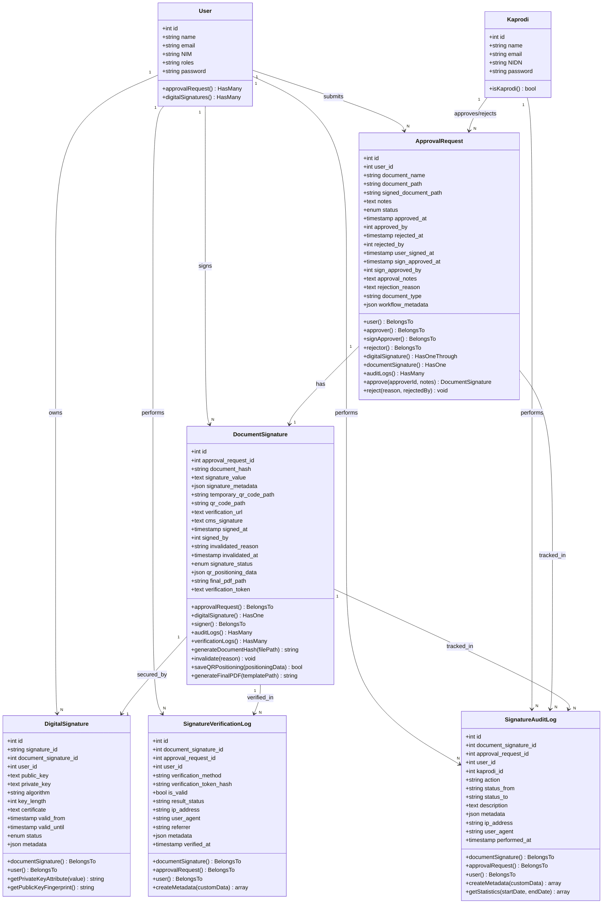

# Dokumentasi Class Diagram - Digital Signature System

**Generated:** 2025-11-20
**Project:** Web UMT - Digital Signature Module
**Route Scope:** `web.php` lines 57-233

---

## 📋 Daftar Isi

-   [1. Overview](#1-overview)
-   [2. Architecture Pattern](#2-architecture-pattern)
-   [3. Class Diagram](#3-class-diagram)
-   [4. Models (Eloquent)](#4-models-eloquent)
-   [5. Controllers](#5-controllers)
-   [6. Services (Business Logic)](#6-services-business-logic)
-   [7. Class Relationships](#7-class-relationships)
-   [8. Design Patterns](#8-design-patterns)

---

## 1. Overview

Dokumentasi ini menjelaskan struktur kelas (Class Diagram) untuk sistem Digital Signature yang diimplementasikan pada route `web.php` baris 57-233.

### Arsitektur:

-   **Pattern:** MVC + Service Layer
-   **Framework:** Laravel 11
-   **Language:** PHP 8.2+
-   **Database ORM:** Eloquent

### Komponen Utama:

-   **7 Models** - Eloquent models (database entities)
-   **3 Controllers** - HTTP request handlers
-   **4 Services** - Business logic layer

---

## 2. Architecture Pattern

```
┌─────────────────────────────────────────────────────┐
│                    CLIENT REQUEST                    │
└───────────────────────┬─────────────────────────────┘
                        │
                        ▼
┌─────────────────────────────────────────────────────┐
│                   ROUTES (web.php)                   │
│  - Authentication Routes                             │
│  - Public Verification Routes                        │
│  - Admin Management Routes                           │
│  - User Signing Routes                               │
└───────────────────────┬─────────────────────────────┘
                        │
                        ▼
┌─────────────────────────────────────────────────────┐
│                    CONTROLLERS                       │
│  ┌─────────────────────────────────────────────┐   │
│  │  AuthController                              │   │
│  │  VerificationController                      │   │
│  │  DigitalSignatureController                  │   │
│  └─────────────────────────────────────────────┘   │
└───────────────────────┬─────────────────────────────┘
                        │
                        ▼
┌─────────────────────────────────────────────────────┐
│                  SERVICE LAYER                       │
│  ┌─────────────────────────────────────────────┐   │
│  │  DigitalSignatureService                     │   │
│  │  VerificationService                         │   │
│  │  QRCodeService                               │   │
│  │  PDFSignatureService                         │   │
│  └─────────────────────────────────────────────┘   │
└───────────────────────┬─────────────────────────────┘
                        │
                        ▼
┌─────────────────────────────────────────────────────┐
│                  MODELS (Eloquent)                   │
│  ┌─────────────────────────────────────────────┐   │
│  │  User, Kaprodi                               │   │
│  │  ApprovalRequest                             │   │
│  │  DocumentSignature                           │   │
│  │  DigitalSignature                            │   │
│  │  SignatureVerificationLog                    │   │
│  │  SignatureAuditLog                           │   │
│  └─────────────────────────────────────────────┘   │
└───────────────────────┬─────────────────────────────┘
                        │
                        ▼
┌─────────────────────────────────────────────────────┐
│                     DATABASE                         │
│  MySQL / MariaDB                                     │
└─────────────────────────────────────────────────────┘
```

---

## 3. Class Diagram

### 3.1 Complete Class Diagram (Mermaid)

```mermaid
classDiagram
    %% ============================================
    %% MODELS (Database Entities)
    %% ============================================

    class User {
        +int id
        +string name
        +string email
        +string NIM
        +string roles
        +timestamp email_verified_at
        +string password
        +string remember_token
        +timestamp created_at
        +timestamp updated_at

        +canAccessPanel(panel) bool
        +approvalRequest() HasMany
        +digitalSignatures() HasMany
        +isAdmin() bool
    }

    class Kaprodi {
        +int id
        +string name
        +string email
        +string NIDN
        +timestamp email_verified_at
        +string password
        +timestamp created_at
        +timestamp updated_at

        +setPasswordAttribute(value) void
        +isKaprodi() bool
    }

    class ApprovalRequest {
        +int id
        +int user_id
        +string document_name
        +string document_path
        +string signed_document_path
        +text notes
        +enum status
        +timestamp approved_at
        +int approved_by
        +timestamp rejected_at
        +int rejected_by
        +timestamp user_signed_at
        +timestamp sign_approved_at
        +int sign_approved_by
        +text approval_notes
        +text rejection_reason
        +string document_type
        +json workflow_metadata
        +timestamp created_at
        +timestamp updated_at

        +user() BelongsTo
        +approver() BelongsTo
        +signApprover() BelongsTo
        +rejector() BelongsTo
        +digitalSignature() HasOneThrough
        +documentSignature() HasOne
        +auditLogs() HasMany
        +isSigned() bool
        +isCompleted() bool
        +isRejected() bool
        +isInvalidated() bool
        +canBeSignedByUser() bool
        +canBeSignApproved() bool
        +approveApprovalRequest(approverId, notes) DocumentSignature
        +reject(reason, rejectedBy) void
        +markUserSigned(signPath) void
        +invalidateSignature() void
        +approveSignature(signPath) void
        +getStatusLabelAttribute() string
        +getStatusBadgeClassAttribute() string
        +getWorkflowProgressAttribute() int
        +getNextActionAttribute() string
        +scopeByStatus(query, status) Builder
        +scopePendingApproval(query) Builder
        +scopeReadyToSign(query) Builder
        +scopePendingSignApproval(query) Builder
        +scopeCompleted(query) Builder
        +scopeByUser(query, userId) Builder
    }

    class DocumentSignature {
        +int id
        +int approval_request_id
        +string document_hash
        +text signature_value
        +json signature_metadata
        +string temporary_qr_code_path
        +string qr_code_path
        +text verification_url
        +text cms_signature
        +timestamp signed_at
        +int signed_by
        +string invalidated_reason
        +timestamp invalidated_at
        +enum signature_status
        +json qr_positioning_data
        +string final_pdf_path
        +text verification_token
        +timestamp created_at
        +timestamp updated_at

        +approvalRequest() BelongsTo
        +digitalSignature() HasOne
        +signer() BelongsTo
        +auditLogs() HasMany
        +verificationLogs() HasMany
        +generateDocumentHash(filePath) string
        +isValid() bool
        +invalidate(reason) void
        +regenerateVerificationToken() string
        +getSignatureInfo() array
        +getStatusLabel() string
        +getStatusBadgeClass() string
        +generateTemporaryQRCode() string
        +clearTemporaryQRCode() void
        +saveQRPositioning(positioningData) bool
        +generateFinalPDF(templatePath) string
        +scopeByStatus(query, status) Builder
        +scopeValid(query) Builder
        +scopePendingSigning(query) Builder
        +scopeRecentlyVerified(query, days) Builder
        +scopeInvalidated(query) Builder
    }

    class DigitalSignature {
        +int id
        +string signature_id
        +int document_signature_id
        +int user_id
        +text public_key
        +text private_key
        +string algorithm
        +int key_length
        +text certificate
        +timestamp valid_from
        +timestamp valid_until
        +enum status
        +json metadata
        +timestamp created_at
        +timestamp updated_at

        +documentSignature() BelongsTo
        +user() BelongsTo
        +isValid() bool
        +isExpiringSoon(days) bool
        +setPrivateKeyAttribute(value) void
        +getPrivateKeyAttribute(value) string
        +getPublicKeyFingerprint() string
        +scopeActive(query) Builder
        +scopeValid(query) Builder
        +scopeExpiringSoon(query, days) Builder
    }

    class SignatureVerificationLog {
        +int id
        +int document_signature_id
        +int approval_request_id
        +int user_id
        +string verification_method
        +string verification_token_hash
        +bool is_valid
        +string result_status
        +string ip_address
        +string user_agent
        +string referrer
        +json metadata
        +timestamp verified_at
        +timestamp created_at
        +timestamp updated_at

        +documentSignature() BelongsTo
        +approvalRequest() BelongsTo
        +user() BelongsTo
        +getDeviceTypeAttribute() string
        +getBrowserNameAttribute() string
        +getIsAnonymousAttribute() bool
        +getFailedReasonAttribute() string
        +getVerificationDurationMsAttribute() int
        +getResultLabelAttribute() string
        +getResultIconAttribute() string
        +getResultColorAttribute() string
        +getMethodLabelAttribute() string
        +scopeSuccessful(query) Builder
        +scopeFailed(query) Builder
        +scopeByMethod(query, method) Builder
        +scopeByDocument(query, documentSignatureId) Builder
        +scopeToday(query) Builder
        +scopeInPeriod(query, startDate, endDate) Builder
        +scopeAnonymous(query) Builder
        +scopeAuthenticated(query) Builder
        +scopeByStatus(query, status) Builder
        +scopeLastNDays(query, days) Builder
        +scopeSuspiciousActivity(query, threshold, hours) Builder
        +createMetadata(customData) array
        +categorizeFailedReason(errorMessage) string
        +getStatistics(startDate, endDate) array
    }

    class SignatureAuditLog {
        +int id
        +int document_signature_id
        +int approval_request_id
        +int user_id
        +int kaprodi_id
        +string action
        +string status_from
        +string status_to
        +text description
        +json metadata
        +string ip_address
        +string user_agent
        +timestamp performed_at
        +timestamp created_at
        +timestamp updated_at

        +documentSignature() BelongsTo
        +approvalRequest() BelongsTo
        +user() BelongsTo
        +getActionLabelAttribute() string
        +getActionIconAttribute() string
        +getActionColorAttribute() string
        +getDeviceTypeAttribute() string
        +getBrowserNameAttribute() string
        +getDurationMsAttribute() int
        +getSessionIdAttribute() string
        +getErrorCodeAttribute() string
        +getErrorMessageAttribute() string
        +getIsSuccessAttribute() bool
        +getDurationHumanAttribute() string
        +scopeByAction(query, action) Builder
        +scopeInPeriod(query, startDate, endDate) Builder
        +scopeByUser(query, userId) Builder
        +scopeByDocument(query, approvalRequestId) Builder
        +scopeFailedActions(query) Builder
        +scopeSuccessfulActions(query) Builder
        +scopeLastNDays(query, days) Builder
        +scopeToday(query) Builder
        +scopeByDeviceType(query, deviceType) Builder
        +scopeByKaprodi(query, kaprodiId) Builder
        +createMetadata(customData) array
        +getStatistics(startDate, endDate) array
    }

    %% ============================================
    %% CONTROLLERS (HTTP Handlers)
    %% ============================================

    class AuthController {
        +login() View
        +user_register() View
        +do_user_register(request) RedirectResponse
        +do_login(request) RedirectResponse
        +logout(request) RedirectResponse
    }

    class VerificationController {
        -VerificationService verificationService
        -QRCodeService qrCodeService

        +__construct(verificationService, qrCodeService) void
        +verificationPage() View
        +verifyByToken(token) View
        +verifyPublic(request) View
        +verifyUploadedPDF(request) View
        +getVerificationDetails(token) JsonResponse
        +bulkVerify(request) JsonResponse
        +getPublicStatistics() JsonResponse
        +downloadCertificate(token) Response
        +viewPublicCertificate(token) JsonResponse
        -parsePublicCertificateInfo(certificate, digitalSignature) array
        -maskFingerprint(fingerprint) string
        -extractTokenFromUrl(url) string
        -formatDocumentInfo(verificationResult) array
        -formatSignatureInfo(verificationResult) array
        -generateVerificationCertificate(verificationResult) string
        -getVerificationCount(period) int
    }

    class DigitalSignatureController {
        -DigitalSignatureService digitalSignatureService
        -QRCodeService qrCodeService
        -VerificationService verificationService
        -PDFSignatureService pdfSignatureService

        +__construct(digitalSignatureService, qrCodeService, verificationService, pdfSignatureService) void
        +adminDashboard() View
        +signDocument(approvalRequestId) View
        +processDocumentSigning(request, approvalRequestId) JsonResponse
        +keysIndex(request) View
        +keyShow(id) View
        +revokeKey(request, id) RedirectResponse
        +exportPublicKey(id) Response
        +keyAuditLog(id) View
        +viewCertificate(id) View|JsonResponse
        -parseCertificateInfo(certificate) array
    }

    %% ============================================
    %% SERVICES (Business Logic Layer)
    %% ============================================

    class DigitalSignatureService {
        +generateKeyPair(keyLength, algorithm, validityYears, signerInfo) array
        +createDigitalSignatureForDocument(documentSignature, validityYears) DigitalSignature
        +createCMSSignature(documentPath, digitalSignature) array
        +verifyCMSSignature(documentPath, cmsSignature, digitalSignatureId) array
        +signDocumentWithUniqueKey(documentSignature, finalPdfPath) DocumentSignature
        +revokeSignature(digitalSignatureId, reason) bool
        -generateSelfSignedCertificate(privateKey, publicKeyDetails, validityYears, signerInfo) string
        -generateFingerprint(publicKey) string
        -isValidX509Certificate(certificate) bool
    }

    class VerificationService {
        -QRCodeService qrCodeService
        -DigitalSignatureService digitalSignatureService

        +__construct(qrCodeService, digitalSignatureService) void
        +verifyByToken(encryptedToken) array
        +verifyById(documentSignatureId, isUploadedPdf) array
        +getVerificationStatistics(period) array
        -performComprehensiveVerification(documentSignature, isUploadedPdf) array
        -verifyDocumentIntegrity(documentSignature, approvalRequest) array
        -verifyCMSSignature(documentSignature, approvalRequest) array
        -verifyTimestamp(documentSignature) array
        -verifyCertificate(digitalSignature) array
        -createVerificationSummary(checks, overallValid) array
        -createVerificationResult(isValid, message, details) array
        -logVerificationAttempt(documentSignature, verificationResult, token, startTime) void
        -determineResultStatus(verificationResult) string
    }

    class QRCodeService {
        -int defaultSize
        -int defaultMargin
        -string defaultFormat

        +generateVerificationQR(documentSignatureId, options) array
        +generateSVGQRCode(documentSignatureId, options) array
        +generateCanvasQRCode(documentSignatureId, canvasOptions) array
        +generateBatchQRCodes(documentSignatureIds, options) array
        +verifyQRCode(encryptedToken) array
        +generateEmailQRCode(documentSignatureId, emailOptions) array
        +cleanupOldQRCodes(daysOld) int
        +decryptVerificationData(token) array
        -createEncryptedVerificationData(documentSignature) string
        -saveQRCodeImage(imageData, documentSignatureId) string
        -saveSVGQRCode(svgData, documentSignatureId) string
    }

    class PDFSignatureService {
        -array tempFilesToClean

        +embedQRCodeIntoPDF(originalPdfPath, qrCodePath, qrPositioningData, documentSignature) string
        +generateQRCodeImage(verificationUrl, documentSignatureId) string
        +cleanupTempFiles(qrCodePath) void
        +isGhostscriptAvailable() bool
        -addQRCodeToPage(pdf, qrCodePath, position, size, pageSize, canvasDimensions) void
        -detectPdfVersion(pdfPath) string
        -convertPdfTo14(inputPath) string
    }

    %% ============================================
    %% RELATIONSHIPS
    %% ============================================

    %% Model Relationships
    User "1" --> "N" ApprovalRequest : submits
    User "1" --> "N" DigitalSignature : owns
    User "1" --> "N" SignatureVerificationLog : performs
    User "1" --> "N" SignatureAuditLog : performs

    Kaprodi "1" --> "N" ApprovalRequest : approves/rejects
    Kaprodi "1" --> "N" DocumentSignature : signs
    Kaprodi "1" --> "N" SignatureAuditLog : performs

    ApprovalRequest "1" --> "1" DocumentSignature : has
    ApprovalRequest "1" --> "N" SignatureVerificationLog : tracked_in
    ApprovalRequest "1" --> "N" SignatureAuditLog : tracked_in

    DocumentSignature "1" --> "1" DigitalSignature : secured_by
    DocumentSignature "1" --> "N" SignatureVerificationLog : verified_in
    DocumentSignature "1" --> "N" SignatureAuditLog : tracked_in

    %% Controller Dependencies
    AuthController ..> User : uses
    AuthController ..> Kaprodi : uses

    VerificationController ..> VerificationService : depends
    VerificationController ..> QRCodeService : depends
    VerificationController ..> DocumentSignature : uses
    VerificationController ..> SignatureVerificationLog : uses

    DigitalSignatureController ..> DigitalSignatureService : depends
    DigitalSignatureController ..> QRCodeService : depends
    DigitalSignatureController ..> VerificationService : depends
    DigitalSignatureController ..> PDFSignatureService : depends
    DigitalSignatureController ..> DigitalSignature : uses
    DigitalSignatureController ..> DocumentSignature : uses
    DigitalSignatureController ..> ApprovalRequest : uses
    DigitalSignatureController ..> SignatureAuditLog : uses

    %% Service Dependencies
    DigitalSignatureService ..> DigitalSignature : creates
    DigitalSignatureService ..> DocumentSignature : updates
    DigitalSignatureService ..> ApprovalRequest : updates
    DigitalSignatureService ..> SignatureAuditLog : creates

    VerificationService ..> QRCodeService : depends
    VerificationService ..> DigitalSignatureService : depends
    VerificationService ..> DocumentSignature : verifies
    VerificationService ..> SignatureVerificationLog : creates

    QRCodeService ..> DocumentSignature : uses
    QRCodeService ..> ApprovalRequest : uses

    PDFSignatureService ..> DocumentSignature : uses
```



### 3.2 Fixed Class Diagram (Mermaid)



---

## 4. Models (Eloquent)

### 4.1 User Model

**File:** `app/Models/User.php`

```php
class User extends Authenticatable implements FilamentUser
```

**Attributes:**

-   `id` - Primary Key
-   `name` - User's full name
-   `email` - Unique email address
-   `NIM` - Student ID (Nomor Induk Mahasiswa)
-   `roles` - User role (admin/user)
-   `email_verified_at` - Email verification timestamp
-   `password` - Hashed password
-   `remember_token` - Remember me token

**Methods:**

-   `canAccessPanel(Panel $panel): bool` - Check Filament access
-   `approvalRequest(): HasMany` - Relationship to approval requests
-   `digitalSignatures(): HasMany` - Relationship to digital signatures
-   `isAdmin(): bool` - Check if user is admin

**Relationships:**

-   `hasMany` → `ApprovalRequest`
-   `hasMany` → `DigitalSignature`
-   `hasMany` → `SignatureVerificationLog`
-   `hasMany` → `SignatureAuditLog`

---

### 4.2 Kaprodi Model

**File:** `app/Models/Kaprodi.php`

```php
class Kaprodi extends Model
```

**Attributes:**

-   `id` - Primary Key
-   `name` - Kaprodi's full name
-   `email` - Unique email
-   `NIDN` - National Lecturer ID
-   `email_verified_at` - Email verification timestamp
-   `password` - Hashed password (auto-hashed)

**Methods:**

-   `setPasswordAttribute($value): void` - Auto-hash password
-   `isKaprodi(): bool` - Always returns true

**Relationships:**

-   Referenced by `ApprovalRequest` (approved_by, rejected_by, sign_approved_by)
-   Referenced by `DocumentSignature` (signed_by)
-   Referenced by `SignatureAuditLog` (kaprodi_id)

---

### 4.3 ApprovalRequest Model

**File:** `app/Models/ApprovalRequest.php`

```php
class ApprovalRequest extends Model
```

**Attributes:**

-   `id` - Primary Key
-   `user_id` - Foreign key to users
-   `document_name` - Document name
-   `document_path` - File path
-   `status` - Workflow status (enum)
-   `approved_at` - Approval timestamp
-   `approved_by` - Foreign key to kaprodis
-   `workflow_metadata` - JSON metadata (document_hash, etc.)

**Key Methods:**

-   `approveApprovalRequest($approverId, $notes): DocumentSignature` - Approve document
-   `reject($reason, $rejectedBy): void` - Reject document
-   `markUserSigned($signPath): void` - Mark as signed by user
-   `canBeSignedByUser(): bool` - Check if ready for signing
-   `getStatusLabelAttribute(): string` - Get status label
-   `getWorkflowProgressAttribute(): int` - Get progress percentage

**Scopes:**

-   `scopePendingApproval()` - Get pending approvals
-   `scopeReadyToSign()` - Get documents ready to sign
-   `scopeCompleted()` - Get completed documents

**Relationships:**

-   `belongsTo` → `User`
-   `belongsTo` → `Kaprodi` (approver, rejector, signApprover)
-   `hasOne` → `DocumentSignature`
-   `hasMany` → `SignatureAuditLog`
-   `hasOneThrough` → `DigitalSignature`

---

### 4.4 DocumentSignature Model

**File:** `app/Models/DocumentSignature.php`

```php
class DocumentSignature extends Model
```

**Attributes:**

-   `id` - Primary Key
-   `approval_request_id` - Foreign key
-   `document_hash` - SHA-256 hash
-   `signature_value` - Signature value
-   `cms_signature` - CMS format signature
-   `signature_status` - Status (pending/signed/verified/invalid)
-   `qr_code_path` - Final QR code path
-   `verification_token` - Public verification token
-   `final_pdf_path` - Path to signed PDF

**Key Methods:**

-   `generateTemporaryQRCode(): string` - Generate temp QR for drag & drop
-   `saveQRPositioning($positioningData): bool` - Save QR position
-   `invalidate($reason): void` - Invalidate signature
-   `getSignatureInfo(): array` - Get signature details
-   `isValid(): bool` - Check validity

**Scopes:**

-   `scopeValid()` - Get valid signatures
-   `scopePendingSigning()` - Get pending signatures
-   `scopeInvalidated()` - Get invalidated signatures

**Relationships:**

-   `belongsTo` → `ApprovalRequest`
-   `hasOne` → `DigitalSignature`
-   `belongsTo` → `Kaprodi` (signer)
-   `hasMany` → `SignatureAuditLog`
-   `hasMany` → `SignatureVerificationLog`

---

### 4.5 DigitalSignature Model

**File:** `app/Models/DigitalSignature.php`

```php
class DigitalSignature extends Model
```

**Attributes:**

-   `id` - Primary Key
-   `signature_id` - Unique signature ID (SIG-XXXX)
-   `document_signature_id` - Foreign key (1:1 unique)
-   `user_id` - Owner of signature
-   `public_key` - RSA public key (PEM)
-   `private_key` - RSA private key (encrypted)
-   `algorithm` - RSA-SHA256
-   `key_length` - 2048 bits
-   `certificate` - X.509 certificate
-   `valid_from` - Start validity
-   `valid_until` - End validity
-   `status` - active/expired

**Key Methods:**

-   `isValid(): bool` - Check if key is valid
-   `isExpiringSoon($days): bool` - Check expiry
-   `getPublicKeyFingerprint(): string` - Get SHA-256 fingerprint
-   `setPrivateKeyAttribute($value)` - Encrypt private key
-   `getPrivateKeyAttribute($value)` - Decrypt private key

**Scopes:**

-   `scopeActive()` - Get active keys
-   `scopeValid()` - Get valid keys
-   `scopeExpiringSoon($days)` - Get expiring keys

**Relationships:**

-   `belongsTo` → `DocumentSignature` (1:1)
-   `belongsTo` → `User`

---

### 4.6 SignatureVerificationLog Model

**File:** `app/Models/SignatureVerificationLog.php`

```php
class SignatureVerificationLog extends Model
```

**Attributes:**

-   `id` - Primary Key
-   `document_signature_id` - Foreign key
-   `approval_request_id` - Foreign key
-   `user_id` - Verifier (nullable for anonymous)
-   `verification_method` - token/url/qr/id/upload
-   `verification_token_hash` - SHA-256 hash
-   `is_valid` - Verification result
-   `result_status` - success/failed/expired/invalid
-   `ip_address` - Verifier IP
-   `user_agent` - Browser info
-   `metadata` - JSON metadata

**Key Methods:**

-   `getDeviceTypeAttribute(): string` - Parse device type
-   `getBrowserNameAttribute(): string` - Parse browser
-   `getIsAnonymousAttribute(): bool` - Check if anonymous
-   `createMetadata($customData): array` - Create standardized metadata
-   `categorizeFailedReason($errorMessage): string` - Categorize error
-   `getStatistics($startDate, $endDate): array` - Get statistics

**Scopes:**

-   `scopeSuccessful()` - Get successful verifications
-   `scopeFailed()` - Get failed verifications
-   `scopeByMethod($method)` - Filter by method
-   `scopeSuspiciousActivity($threshold, $hours)` - Detect suspicious activity

**Relationships:**

-   `belongsTo` → `DocumentSignature`
-   `belongsTo` → `ApprovalRequest`
-   `belongsTo` → `User`

---

### 4.7 SignatureAuditLog Model

**File:** `app/Models/SignatureAuditLog.php`

```php
class SignatureAuditLog extends Model
```

**Attributes:**

-   `id` - Primary Key
-   `document_signature_id` - Foreign key
-   `approval_request_id` - Foreign key
-   `user_id` - Actor (user)
-   `kaprodi_id` - Actor (kaprodi)
-   `action` - Action type (constant)
-   `status_from` - Previous status
-   `status_to` - New status
-   `description` - Action description
-   `metadata` - JSON metadata
-   `performed_at` - Action timestamp

**Action Constants:**

-   `ACTION_SIGNATURE_INITIATED` - Signature process started
-   `ACTION_DOCUMENT_SIGNED` - Document signed
-   `ACTION_SIGNATURE_VERIFIED` - Signature verified
-   `ACTION_SIGNATURE_INVALIDATED` - Signature invalidated
-   `ACTION_SIGNATURE_KEY_GENERATED` - Key generated
-   `ACTION_SIGNATURE_KEY_REVOKED` - Key revoked
-   `ACTION_SIGNING_FAILED` - Signing failed

**Key Methods:**

-   `getActionLabelAttribute(): string` - Get action label
-   `getActionIconAttribute(): string` - Get icon class
-   `getActionColorAttribute(): string` - Get color class
-   `getDurationMsAttribute(): int` - Get duration
-   `createMetadata($customData): array` - Create metadata
-   `getStatistics($startDate, $endDate): array` - Get statistics

**Scopes:**

-   `scopeByAction($action)` - Filter by action
-   `scopeFailedActions()` - Get failed actions
-   `scopeSuccessfulActions()` - Get successful actions
-   `scopeToday()` - Get today's logs

**Relationships:**

-   `belongsTo` → `DocumentSignature`
-   `belongsTo` → `ApprovalRequest`
-   `belongsTo` → `User`
-   `belongsTo` → `Kaprodi`

---

## 5. Controllers

### 5.1 AuthController

**File:** `app/Http/Controllers/AuthController.php`

**Responsibility:** Handle authentication (login, logout, registration)

**Methods:**

| Method                      | Route               | Description                 |
| --------------------------- | ------------------- | --------------------------- |
| `login()`                   | GET /login          | Show login form             |
| `do_login(Request)`         | POST /login         | Process login (multi-guard) |
| `logout(Request)`           | GET /logout         | Logout user                 |
| `user_register()`           | GET /user-register  | Show registration form      |
| `do_user_register(Request)` | POST /user-register | Process user registration   |

**Dependencies:**

-   `User` model
-   `Kaprodi` model
-   Laravel Auth facade

**Authentication Logic:**

```php
// Try web guard first (users)
if (Auth::guard('web')->attempt($credentials)) {
    return redirect('/');
}

// Then try kaprodi guard
if (Auth::guard('kaprodi')->attempt($credentials)) {
    return redirect('/admin/signature/dashboard');
}
```

---

### 5.2 VerificationController

**File:** `app/Http/Controllers/DigitalSignature/VerificationController.php`

**Responsibility:** Handle public document verification

**Dependencies:**

```php
private VerificationService $verificationService;
private QRCodeService $qrCodeService;
```

**Methods:**

| Method                           | Route                                   | Description             |
| -------------------------------- | --------------------------------------- | ----------------------- |
| `verificationPage()`             | GET /signature/verify                   | Show verification page  |
| `verifyByToken($token)`          | GET /signature/verify/{token}           | Verify by QR token      |
| `verifyPublic(Request)`          | POST /signature/verify                  | Form verification       |
| `verifyUploadedPDF(Request)`     | POST /signature/verify-upload           | Verify uploaded PDF     |
| `getVerificationDetails($token)` | GET /signature/api/verify/{token}       | API: Get details        |
| `bulkVerify(Request)`            | POST /signature/api/bulk-verify         | API: Bulk verify        |
| `downloadCertificate($token)`    | GET /signature/certificate/{token}      | Download certificate    |
| `viewPublicCertificate($token)`  | GET /signature/certificate/view/{token} | View certificate (AJAX) |

**Rate Limiting:**

-   `verifyByToken`: 10 attempts per 5 minutes
-   `verifyPublic`: 5 attempts per 5 minutes
-   `bulkVerify`: 3 attempts per 10 minutes (requires API key)

**Private Methods:**

-   `extractTokenFromUrl($url): string` - Extract token from URL
-   `formatDocumentInfo($verificationResult): array` - Format document info
-   `formatSignatureInfo($verificationResult): array` - Format signature info
-   `parsePublicCertificateInfo($certificate, $digitalSignature): array` - Parse certificate (public safe)
-   `maskFingerprint($fingerprint): string` - Mask fingerprint for security

---

### 5.3 DigitalSignatureController

**File:** `app/Http/Controllers/DigitalSignature/DigitalSignatureController.php`

**Responsibility:** Handle digital signature management & document signing

**Dependencies:**

```php
private DigitalSignatureService $digitalSignatureService;
private QRCodeService $qrCodeService;
private VerificationService $verificationService;
private PDFSignatureService $pdfSignatureService;
```

**Methods:**

#### Admin Routes (auth:kaprodi)

| Method                    | Route                                            | Description            |
| ------------------------- | ------------------------------------------------ | ---------------------- |
| `adminDashboard()`        | GET /admin/signature/dashboard                   | Admin dashboard        |
| `keysIndex(Request)`      | GET /admin/signature/keys                        | List all keys          |
| `keyShow($id)`            | GET /admin/signature/keys/{id}                   | Key details            |
| `revokeKey(Request, $id)` | POST /admin/signature/keys/{id}/revoke           | Revoke key             |
| `exportPublicKey($id)`    | GET /admin/signature/keys/{id}/export-public-key | Export public key      |
| `keyAuditLog($id)`        | GET /admin/signature/keys/{id}/audit-log         | View audit log         |
| `viewCertificate($id)`    | GET /admin/signature/keys/{id}/certificate       | View X.509 certificate |

#### User Routes (auth:web)

| Method                                                | Route                                  | Description            |
| ----------------------------------------------------- | -------------------------------------- | ---------------------- |
| `signDocument($approvalRequestId)`                    | GET /user/signature/sign/{id}          | Show signing interface |
| `processDocumentSigning(Request, $approvalRequestId)` | POST /user/signature/sign/{id}/process | Process signing        |

**Key Business Logic - processDocumentSigning():**

```
1. Verify document integrity (hash check)
2. Save QR positioning data
3. Generate final verification QR code
4. Embed QR code into PDF at user position
5. Auto-generate unique RSA key pair
6. Sign document with CMS signature
7. Auto-approve signature
8. Create audit log
9. Send email notification
```

**Private Methods:**

-   `parseCertificateInfo($certificate): array` - Parse X.509 certificate with OpenSSL

---

## 6. Services (Business Logic)

### 6.1 DigitalSignatureService

**File:** `app/Services/DigitalSignatureService.php`

**Responsibility:** Digital signature key generation, CMS signing, verification

**Public Methods:**

| Method                                                                  | Description                                            | Return            |
| ----------------------------------------------------------------------- | ------------------------------------------------------ | ----------------- |
| `generateKeyPair($keyLength, $algorithm, $validityYears, $signerInfo)`  | Generate RSA-2048 key pair + X.509 certificate         | array             |
| `createDigitalSignatureForDocument($documentSignature, $validityYears)` | Create unique digital signature key for document       | DigitalSignature  |
| `createCMSSignature($documentPath, $digitalSignature)`                  | Create CMS signature for document                      | array             |
| `verifyCMSSignature($documentPath, $cmsSignature, $digitalSignatureId)` | Verify CMS signature                                   | array             |
| `signDocumentWithUniqueKey($documentSignature, $finalPdfPath)`          | Sign document with auto-generated key (DB transaction) | DocumentSignature |
| `revokeSignature($digitalSignatureId, $reason)`                         | Revoke digital signature key                           | bool              |

**Private Methods:**

-   `generateSelfSignedCertificate($privateKey, $publicKeyDetails, $validityYears, $signerInfo): string` - Generate X.509 certificate
-   `generateFingerprint($publicKey): string` - Generate SHA-256 fingerprint
-   `isValidX509Certificate($certificate): bool` - Validate X.509 format

**Security Features:**

-   Private key encryption (Laravel Crypt)
-   X.509 v3 certificate generation
-   CMS signature format (RFC 5652)
-   SHA-256 hashing
-   Database transactions for atomic operations

---

### 6.2 VerificationService

**File:** `app/Services/VerificationService.php`

**Responsibility:** Comprehensive document signature verification

**Dependencies:**

```php
private QRCodeService $qrCodeService;
private DigitalSignatureService $digitalSignatureService;
```

**Public Methods:**

| Method                                             | Description                          | Return |
| -------------------------------------------------- | ------------------------------------ | ------ |
| `verifyByToken($encryptedToken)`                   | Verify document by QR token          | array  |
| `verifyById($documentSignatureId, $isUploadedPdf)` | Verify document by ID                | array  |
| `getVerificationStatistics($period)`               | Get verification statistics (cached) | array  |

**Private Methods:**

-   `performComprehensiveVerification($documentSignature, $isUploadedPdf): array` - Main verification logic
-   `verifyDocumentIntegrity($documentSignature, $approvalRequest): array` - Check document hash
-   `verifyCMSSignature($documentSignature, $approvalRequest): array` - Verify CMS signature
-   `verifyTimestamp($documentSignature): array` - Validate timestamp
-   `verifyCertificate($digitalSignature): array` - Validate X.509 certificate
-   `createVerificationSummary($checks, $overallValid): array` - Create summary
-   `createVerificationResult($isValid, $message, $details): array` - Create result
-   `logVerificationAttempt($documentSignature, $verificationResult, $token, $startTime): void` - Log verification
-   `determineResultStatus($verificationResult): string` - Determine status

**Verification Checks:**

1. ✅ Document signature existence & status
2. ✅ Digital signature key validity
3. ✅ Approval request status
4. ✅ Document integrity (hash verification)
5. ✅ CMS signature cryptographic verification
6. ✅ Timestamp validity
7. ✅ X.509 certificate validity
8. ✅ Upload verification (byte-by-byte comparison)

---

### 6.3 QRCodeService

**File:** `app/Services/QRCodeService.php`

**Responsibility:** QR code generation & verification

**Libraries:**

-   `endroid/qr-code` - QR code generation

**Public Methods:**

| Method                                                       | Description                            | Return |
| ------------------------------------------------------------ | -------------------------------------- | ------ |
| `generateVerificationQR($documentSignatureId, $options)`     | Generate verification QR code (PNG)    | array  |
| `generateSVGQRCode($documentSignatureId, $options)`          | Generate SVG QR code                   | array  |
| `generateCanvasQRCode($documentSignatureId, $canvasOptions)` | Generate QR for canvas                 | array  |
| `generateBatchQRCodes($documentSignatureIds, $options)`      | Batch QR generation                    | array  |
| `verifyQRCode($encryptedToken)`                              | Verify QR code data                    | array  |
| `generateEmailQRCode($documentSignatureId, $emailOptions)`   | Generate QR for email                  | array  |
| `cleanupOldQRCodes($daysOld)`                                | Clean up old QR files                  | int    |
| `decryptVerificationData($token)`                            | Decrypt QR data (supports short codes) | array  |

**Private Methods:**

-   `createEncryptedVerificationData($documentSignature): string` - Create encrypted payload + short code mapping
-   `saveQRCodeImage($imageData, $documentSignatureId): string` - Save QR image
-   `saveSVGQRCode($svgData, $documentSignatureId): string` - Save SVG QR

**Short Code Feature:**

-   Hybrid approach: Full encryption + short code mapping
-   Short code format: `XXXX-XXXX-XXXX` (12-20 chars)
-   Maps to full encrypted payload in database
-   Reduces QR code complexity
-   Tracks access count & analytics

---

### 6.4 PDFSignatureService

**File:** `app/Services/PDFSignatureService.php`

**Responsibility:** PDF manipulation (embed QR code)

**Libraries:**

-   `setasign/fpdi` - PDF import/export
-   `tecnickcom/tcpdf` - PDF generation

**Public Methods:**

| Method                                                                                      | Description                    | Return |
| ------------------------------------------------------------------------------------------- | ------------------------------ | ------ |
| `embedQRCodeIntoPDF($originalPdfPath, $qrCodePath, $qrPositioningData, $documentSignature)` | Embed QR code at user position | string |
| `generateQRCodeImage($verificationUrl, $documentSignatureId)`                               | Generate QR image              | string |
| `cleanupTempFiles($qrCodePath)`                                                             | Clean up temporary files       | void   |
| `isGhostscriptAvailable()`                                                                  | Check Ghostscript availability | bool   |

**Private Methods:**

-   `addQRCodeToPage($pdf, $qrCodePath, $position, $size, $pageSize, $canvasDimensions): void` - Add QR to page
-   `detectPdfVersion($pdfPath): string` - Detect PDF version (1.4, 1.5, 1.7)
-   `convertPdfTo14($inputPath): string` - Convert PDF to 1.4 (Ghostscript)

**PDF Version Handling:**

-   Detects PDF version from header
-   Auto-converts PDF 1.5+ to 1.4 if needed (FPDI compatibility)
-   Uses Ghostscript for conversion
-   Fallback to original if conversion fails

**Coordinate Conversion:**

-   Converts canvas pixels to PDF millimeters
-   Supports canvas dimension scaling
-   Default: 96 DPI (1 px = 0.2645833333 mm)

---

## 7. Class Relationships

### 7.1 Dependency Graph

```
┌─────────────────────────────────────────────────────────┐
│                   DEPENDENCY FLOW                        │
└─────────────────────────────────────────────────────────┘

Controllers depend on Services:
    DigitalSignatureController
        ├── DigitalSignatureService
        ├── QRCodeService
        ├── VerificationService
        └── PDFSignatureService

    VerificationController
        ├── VerificationService
        └── QRCodeService

    AuthController
        ├── User (Model)
        └── Kaprodi (Model)

Services depend on other Services:
    VerificationService
        ├── QRCodeService
        └── DigitalSignatureService

Services depend on Models:
    DigitalSignatureService
        ├── DigitalSignature
        ├── DocumentSignature
        ├── ApprovalRequest
        └── SignatureAuditLog

    VerificationService
        ├── DocumentSignature
        └── SignatureVerificationLog

    QRCodeService
        ├── DocumentSignature
        └── ApprovalRequest

    PDFSignatureService
        └── DocumentSignature

Models depend on other Models (Relationships):
    User
        ├── ApprovalRequest (hasMany)
        ├── DigitalSignature (hasMany)
        ├── SignatureVerificationLog (hasMany)
        └── SignatureAuditLog (hasMany)

    ApprovalRequest
        ├── User (belongsTo)
        ├── Kaprodi (belongsTo × 3)
        ├── DocumentSignature (hasOne)
        ├── DigitalSignature (hasOneThrough)
        └── SignatureAuditLog (hasMany)

    DocumentSignature
        ├── ApprovalRequest (belongsTo)
        ├── DigitalSignature (hasOne)
        ├── Kaprodi (belongsTo)
        ├── SignatureAuditLog (hasMany)
        └── SignatureVerificationLog (hasMany)

    DigitalSignature
        ├── DocumentSignature (belongsTo)
        └── User (belongsTo)
```

### 7.2 Interaction Diagram (Document Signing Flow)

```
User                Controller              Service                Model
 │                      │                      │                     │
 │  POST /sign/{id}     │                      │                     │
 ├─────────────────────>│                      │                     │
 │                      │                      │                     │
 │                      │  1. Verify hash      │                     │
 │                      ├─────────────────────>│                     │
 │                      │                      │   Get approval      │
 │                      │                      ├────────────────────>│
 │                      │                      │<────────────────────┤
 │                      │<─────────────────────┤                     │
 │                      │                      │                     │
 │                      │  2. Generate QR      │                     │
 │                      ├─────────────────────>│                     │
 │                      │     (QRCodeService)  │                     │
 │                      │<─────────────────────┤                     │
 │                      │                      │                     │
 │                      │  3. Embed QR to PDF  │                     │
 │                      ├─────────────────────>│                     │
 │                      │  (PDFSignatureService)│                    │
 │                      │<─────────────────────┤                     │
 │                      │                      │                     │
 │                      │  4. Generate key     │                     │
 │                      ├─────────────────────>│                     │
 │                      │ (DigitalSignatureService)                  │
 │                      │                      │   Create key        │
 │                      │                      ├────────────────────>│
 │                      │                      │<────────────────────┤
 │                      │<─────────────────────┤                     │
 │                      │                      │                     │
 │                      │  5. Sign document    │                     │
 │                      ├─────────────────────>│                     │
 │                      │ (DigitalSignatureService)                  │
 │                      │                      │   Update signature  │
 │                      │                      ├────────────────────>│
 │                      │                      │<────────────────────┤
 │                      │<─────────────────────┤                     │
 │                      │                      │                     │
 │                      │  6. Create audit log │                     │
 │                      │                      ├────────────────────>│
 │                      │                      │<────────────────────┤
 │                      │                      │                     │
 │  JSON response       │                      │                     │
 │<─────────────────────┤                      │                     │
 │                      │                      │                     │
```

---

## 8. Design Patterns

### 8.1 Service Layer Pattern

**Purpose:** Separate business logic from controllers

**Implementation:**

```php
// Controller only handles HTTP
class DigitalSignatureController {
    public function processDocumentSigning(Request $request, $id) {
        // 1. Validate request
        // 2. Delegate to service
        $result = $this->digitalSignatureService->signDocumentWithUniqueKey(...);
        // 3. Return response
        return response()->json($result);
    }
}

// Service handles business logic
class DigitalSignatureService {
    public function signDocumentWithUniqueKey($documentSignature, $finalPdfPath) {
        // Complex business logic here
        DB::transaction(function() {
            // 1. Generate key
            // 2. Create CMS signature
            // 3. Update database
            // 4. Create audit log
        });
    }
}
```

**Benefits:**

-   ✅ Controllers stay thin
-   ✅ Business logic reusable
-   ✅ Easier to test
-   ✅ Clear separation of concerns

---

### 8.2 Repository Pattern (via Eloquent)

**Purpose:** Abstract database access

**Implementation:**

```php
// Model acts as repository
class ApprovalRequest extends Model {
    // Query scopes act as repository methods
    public function scopePendingApproval($query) {
        return $query->where('status', self::STATUS_PENDING);
    }

    public function scopeReadyToSign($query) {
        return $query->where('status', self::STATUS_APPROVED);
    }
}

// Usage in service/controller
$pending = ApprovalRequest::pendingApproval()->get();
$ready = ApprovalRequest::readyToSign()->latest()->get();
```

---

### 8.3 Factory Pattern (Metadata Creation)

**Purpose:** Standardize object creation

**Implementation:**

```php
class SignatureAuditLog {
    public static function createMetadata($customData = []) {
        $baseMetadata = [
            'timestamp' => now()->timestamp,
            'session_id' => session()->getId(),
            'device_type' => self::detectDeviceType(...),
            'browser' => self::detectBrowserName(...),
            'platform' => self::detectPlatform(...),
        ];

        return array_merge($baseMetadata, $customData);
    }
}

// Usage
$metadata = SignatureAuditLog::createMetadata([
    'signature_id' => $signature->signature_id,
    'action' => 'document_signed'
]);
```

---

### 8.4 Strategy Pattern (Verification Methods)

**Purpose:** Encapsulate algorithms

**Implementation:**

```php
class VerificationService {
    private function performComprehensiveVerification($documentSignature) {
        $checks = [];

        // Strategy 1: Document integrity check
        $checks['document_integrity'] = $this->verifyDocumentIntegrity(...);

        // Strategy 2: CMS signature check
        $checks['cms_signature'] = $this->verifyCMSSignature(...);

        // Strategy 3: Timestamp check
        $checks['timestamp'] = $this->verifyTimestamp(...);

        // Strategy 4: Certificate check
        $checks['certificate'] = $this->verifyCertificate(...);

        return $this->createVerificationResult($checks);
    }
}
```

---

### 8.5 Observer Pattern (Model Events)

**Purpose:** React to model events

**Implementation:**

```php
class ApprovalRequest extends Model {
    public static function boot() {
        parent::boot();

        // Observer: When creating
        static::creating(function ($model) {
            // Auto-generate nomor if needed
        });

        // Observer: When created
        static::created(function ($model) {
            // Create audit log
            SignatureAuditLog::create([...]);
        });
    }
}
```

---

### 8.6 Dependency Injection Pattern

**Purpose:** Inject dependencies via constructor

**Implementation:**

```php
class VerificationController {
    private $verificationService;
    private $qrCodeService;

    // Laravel auto-injects these
    public function __construct(
        VerificationService $verificationService,
        QRCodeService $qrCodeService
    ) {
        $this->verificationService = $verificationService;
        $this->qrCodeService = $qrCodeService;
    }
}
```

**Benefits:**

-   ✅ Testable (can mock dependencies)
-   ✅ Flexible (can swap implementations)
-   ✅ Clear dependencies

---

### 8.7 Transaction Script Pattern

**Purpose:** Wrap business operations in DB transaction

**Implementation:**

```php
class DigitalSignatureService {
    public function signDocumentWithUniqueKey($documentSignature, $finalPdfPath) {
        DB::beginTransaction();

        try {
            // Step 1: Generate key
            $digitalSignature = $this->createDigitalSignatureForDocument(...);

            // Step 2: Create CMS signature
            $signatureData = $this->createCMSSignature(...);

            // Step 3: Update DocumentSignature
            $documentSignature->update([...]);

            // Step 4: Update ApprovalRequest
            $approvalRequest->update([...]);

            // Step 5: Create audit log
            SignatureAuditLog::create([...]);

            DB::commit();
            return $documentSignature;

        } catch (\Exception $e) {
            DB::rollBack();
            throw $e;
        }
    }
}
```

**Benefits:**

-   ✅ Atomic operations
-   ✅ Data consistency
-   ✅ Auto-rollback on error

---

## 📊 Summary Statistics

### Total Classes: 14

-   **Models:** 7 (User, Kaprodi, ApprovalRequest, DocumentSignature, DigitalSignature, SignatureVerificationLog, SignatureAuditLog)
-   **Controllers:** 3 (AuthController, VerificationController, DigitalSignatureController)
-   **Services:** 4 (DigitalSignatureService, VerificationService, QRCodeService, PDFSignatureService)

### Total Methods: 150+

-   **Public Methods:** 90+
-   **Private Methods:** 60+

### Design Patterns Used: 7

1. Service Layer Pattern
2. Repository Pattern (via Eloquent)
3. Factory Pattern
4. Strategy Pattern
5. Observer Pattern
6. Dependency Injection Pattern
7. Transaction Script Pattern

---

## 🔑 Key Architectural Decisions

### 1. Service Layer Separation

**Decision:** Extract business logic into service classes

**Rationale:**

-   Controllers stay thin and focused on HTTP
-   Business logic is reusable across controllers
-   Easier to test business logic in isolation
-   Clear separation of concerns

### 2. Per-Document Unique Keys

**Decision:** Generate unique RSA key pair for each document

**Rationale:**

-   Enhanced security (one key compromise doesn't affect all documents)
-   Better key lifecycle management
-   Easier key revocation
-   Complies with best practices for digital signatures

### 3. Comprehensive Verification

**Decision:** Multiple verification checks (8 different checks)

**Rationale:**

-   Defense in depth
-   Catch different types of tampering
-   Provide detailed verification reports
-   Build trust in the system

### 4. Hybrid Short Code + Encryption

**Decision:** Use short codes with full encryption fallback

**Rationale:**

-   Shorter QR codes (easier to scan)
-   Maintains full security (encryption)
-   Better user experience
-   Backward compatible

### 5. Transaction-based Signing

**Decision:** Wrap signing process in database transaction

**Rationale:**

-   Ensure data consistency
-   Prevent partial signatures
-   Auto-rollback on errors
-   Maintain referential integrity

---

## 📚 External Libraries

### Core Dependencies:

-   **Laravel Framework 11** - MVC framework
-   **endroid/qr-code** - QR code generation
-   **setasign/fpdi** - PDF import/export
-   **tecnickcom/tcpdf** - PDF manipulation
-   **Ghostscript** - PDF version conversion (optional)

---

**Last Updated:** 2025-11-20
**Version:** 1.0
**Author:** Generated by Claude Code Analysis

```mermaid

```
