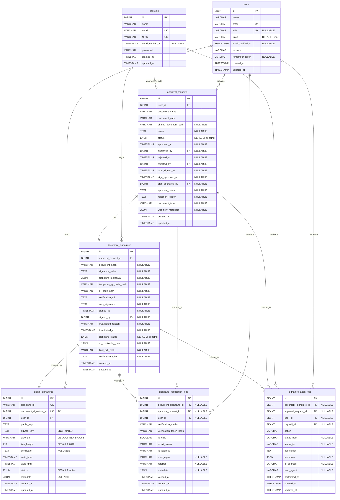
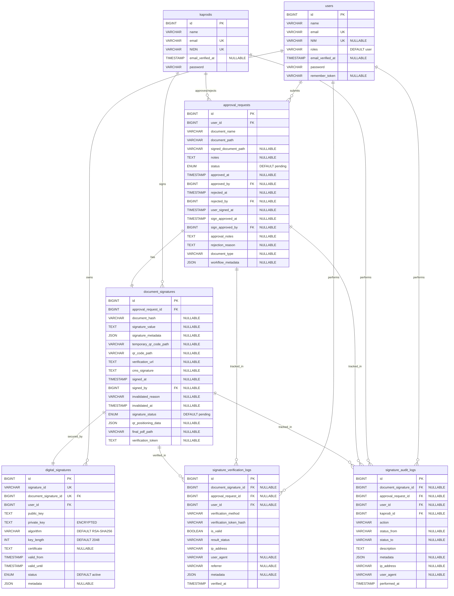

# Dokumentasi ERD - Digital Signature System

**Generated:** 2025-11-19
**Project:** Web UMT - Digital Signature Module
**Route Scope:** `web.php` lines 57-233

---

## 📋 Daftar Isi

-   [1. Overview](#1-overview)
-   [2. Controllers yang Terlibat](#2-controllers-yang-terlibat)
-   [3. Models dan Database Schema](#3-models-dan-database-schema)
-   [4. Entity Relationship Diagram](#4-entity-relationship-diagram)
-   [5. Alur Kerja Sistem](#5-alur-kerja-sistem)
-   [6. Relasi Antar Tabel](#6-relasi-antar-tabel)
-   [7. Indexes dan Optimasi](#7-indexes-dan-optimasi)

---

## 1. Overview

Dokumentasi ini menjelaskan struktur database dan Entity Relationship Diagram (ERD) untuk sistem Digital Signature yang diimplementasikan pada route `web.php` baris 57-233.

### Fitur Utama:

-   ✅ Authentication (User & Kaprodi dengan multi-guard)
-   ✅ Document Approval Workflow
-   ✅ Digital Signature Generation (per-document unique key)
-   ✅ Public Document Verification (QR Code & Token)
-   ✅ Comprehensive Audit Trail
-   ✅ Verification Logs & Statistics

### Teknologi:

-   **Framework:** Laravel 11
-   **Database:** MySQL
-   **Authentication:** Multi-guard (web, kaprodi)
-   **Signature Algorithm:** RSA-SHA256 (2048 bit)
-   **Verification:** QR Code + Token-based

---

## 2. Controllers yang Terlibat

Berdasarkan analisis route yang di-select, terdapat **3 controller utama**:

### 2.1 AuthController

**File:** `app/Http/Controllers/AuthController.php`

**Routes:**

-   `GET  /login` - Halaman login
-   `POST /login` - Proses login (multi-guard: web, kaprodi)
-   `GET  /logout` - Logout
-   `GET  /user-register` - Halaman registrasi user
-   `POST /user-register` - Proses registrasi user

**Models yang Digunakan:**

-   `User`
-   `Kaprodi`

**Fungsi Utama:**

-   Login dengan multi-guard authentication
-   Registrasi user baru (mahasiswa)
-   Logout session

---

### 2.2 VerificationController

**File:** `app/Http/Controllers/DigitalSignature/VerificationController.php`

**Routes:**

```
GET  /signature/verify                    - Public verification page
GET  /signature/verify/{token}            - Verify by QR token/URL
POST /signature/verify                    - Public verification form submission
POST /signature/verify-upload             - Verify uploaded PDF document
GET  /signature/api/verify/{token}        - API: Get verification details
POST /signature/api/bulk-verify           - API: Bulk verification
GET  /signature/api/statistics            - API: Public statistics
GET  /signature/certificate/{token}       - Download verification certificate
GET  /signature/certificate/view/{token}  - View X.509 certificate details
```

**Models yang Digunakan:**

-   `DocumentSignature`
-   `SignatureVerificationLog`
-   `DigitalSignature`
-   `ApprovalRequest`

**Fungsi Utama:**

-   Public document verification (QR code, token, upload)
-   API endpoints untuk verification
-   Certificate viewing & downloading
-   Verification logging & statistics

---

### 2.3 DigitalSignatureController

**File:** `app/Http/Controllers/DigitalSignature/DigitalSignatureController.php`

**Routes:**

#### Admin Routes (auth:kaprodi):

```
GET  /admin/signature/dashboard                    - Admin dashboard
GET  /admin/signature/keys                         - List digital signature keys
GET  /admin/signature/keys/{id}                    - Key details
POST /admin/signature/keys/{id}/revoke             - Revoke key
GET  /admin/signature/keys/{id}/export-public-key  - Export public key
GET  /admin/signature/keys/{id}/audit-log          - Key audit log
GET  /admin/signature/keys/{id}/certificate        - View certificate
GET  /admin/signature/documents                    - List document signatures
GET  /admin/signature/documents/{id}               - Document signature details
POST /admin/signature/documents/{id}/invalidate    - Invalidate signature
```

#### User Routes (auth:web):

```
GET  /user/signature/sign/{approvalRequestId}              - Sign document interface
POST /user/signature/sign/{approvalRequestId}/process      - Process document signing
GET  /user/signature/my-signatures                         - User's signatures list
GET  /user/signature/my-signatures/{id}                    - Signature details
```

**Models yang Digunakan:**

-   `DigitalSignature`
-   `DocumentSignature`
-   `ApprovalRequest`
-   `SignatureAuditLog`

**Fungsi Utama:**

-   Dashboard & statistics
-   Digital signature keys management
-   Document signing (QR drag & drop)
-   Auto-generate unique key per document
-   Signature verification & invalidation
-   Audit trail

---

## 3. Models dan Database Schema

### 3.1 Model: `users`

**Migration:** `0001_01_01_000000_create_users_table.php`
**Table Name:** `users`

#### Fields:

| Column              | Type            | Attributes         | Description            |
| ------------------- | --------------- | ------------------ | ---------------------- |
| `id`                | BIGINT UNSIGNED | PK, AUTO_INCREMENT | Primary Key            |
| `name`              | VARCHAR(255)    | NOT NULL           | Nama lengkap user      |
| `email`             | VARCHAR(255)    | UNIQUE, NOT NULL   | Email (unique)         |
| `NIM`               | VARCHAR(255)    | UNIQUE, NULLABLE   | Nomor Induk Mahasiswa  |
| `roles`             | VARCHAR(255)    | DEFAULT 'user'     | Role user (admin/user) |
| `email_verified_at` | TIMESTAMP       | NULLABLE           | Waktu verifikasi email |
| `password`          | VARCHAR(255)    | NOT NULL           | Password (hashed)      |
| `remember_token`    | VARCHAR(100)    | NULLABLE           | Remember me token      |
| `created_at`        | TIMESTAMP       | AUTO               | Waktu dibuat           |
| `updated_at`        | TIMESTAMP       | AUTO               | Waktu diupdate         |

#### Relationships:

-   `hasMany` → `ApprovalRequest` (1:N)
-   `hasMany` → `DigitalSignature` (1:N)
-   `hasMany` → `SignatureVerificationLog` (1:N)
-   `hasMany` → `SignatureAuditLog` (1:N)

---

### 3.2 Model: `kaprodis`

**Migration:** `2024_07_22_002040_create_kaprodis_table.php`
**Table Name:** `kaprodis`

#### Fields:

| Column              | Type            | Attributes         | Description                |
| ------------------- | --------------- | ------------------ | -------------------------- |
| `id`                | BIGINT UNSIGNED | PK, AUTO_INCREMENT | Primary Key                |
| `name`              | VARCHAR(255)    | NOT NULL           | Nama lengkap kaprodi       |
| `email`             | VARCHAR(255)    | UNIQUE, NOT NULL   | Email (unique)             |
| `NIDN`              | VARCHAR(255)    | UNIQUE, NOT NULL   | Nomor Induk Dosen Nasional |
| `email_verified_at` | TIMESTAMP       | NULLABLE           | Waktu verifikasi email     |
| `password`          | VARCHAR(255)    | NOT NULL           | Password (hashed)          |
| `created_at`        | TIMESTAMP       | AUTO               | Waktu dibuat               |
| `updated_at`        | TIMESTAMP       | AUTO               | Waktu diupdate             |

#### Relationships:

-   Referenced by `approval_requests.approved_by` (1:N)
-   Referenced by `approval_requests.rejected_by` (1:N)
-   Referenced by `approval_requests.sign_approved_by` (1:N)
-   Referenced by `document_signatures.signed_by` (1:N)
-   Referenced by `signature_audit_logs.kaprodi_id` (1:N)

---

### 3.3 Model: `approval_requests`

**Migration:** `2025_10_17_143827_update_approval_requests_table.php`
**Table Name:** `approval_requests`

#### Fields:

| Column                 | Type            | Attributes                  | Description                            |
| ---------------------- | --------------- | --------------------------- | -------------------------------------- |
| `id`                   | BIGINT UNSIGNED | PK, AUTO_INCREMENT          | Primary Key                            |
| `user_id`              | BIGINT UNSIGNED | FK → users.id               | User yang mengajukan                   |
| `document_name`        | VARCHAR(255)    | NOT NULL                    | Nama dokumen                           |
| `document_path`        | VARCHAR(255)    | NOT NULL                    | Path file dokumen                      |
| `signed_document_path` | VARCHAR(255)    | NULLABLE                    | Path dokumen yang sudah ditandatangani |
| `notes`                | TEXT            | NULLABLE                    | Catatan user                           |
| `status`               | ENUM            | NOT NULL, DEFAULT 'pending' | Status workflow                        |
| `approved_at`          | TIMESTAMP       | NULLABLE                    | Waktu approve                          |
| `approved_by`          | BIGINT UNSIGNED | FK → kaprodis.id, NULLABLE  | Kaprodi yang approve                   |
| `rejected_at`          | TIMESTAMP       | NULLABLE                    | Waktu reject                           |
| `rejected_by`          | BIGINT UNSIGNED | FK → kaprodis.id, NULLABLE  | Kaprodi yang reject                    |
| `user_signed_at`       | TIMESTAMP       | NULLABLE                    | Waktu user tanda tangan                |
| `sign_approved_at`     | TIMESTAMP       | NULLABLE                    | Waktu approve tanda tangan             |
| `sign_approved_by`     | BIGINT UNSIGNED | FK → kaprodis.id, NULLABLE  | Kaprodi yang approve sign              |
| `approval_notes`       | TEXT            | NULLABLE                    | Catatan approval                       |
| `rejection_reason`     | TEXT            | NULLABLE                    | Alasan reject                          |
| `document_type`        | VARCHAR(255)    | NULLABLE                    | Jenis dokumen                          |
| `workflow_metadata`    | JSON            | NULLABLE                    | Metadata workflow (document_hash, dll) |
| `created_at`           | TIMESTAMP       | AUTO                        | Waktu dibuat                           |
| `updated_at`           | TIMESTAMP       | AUTO                        | Waktu diupdate                         |

#### Status Enum Values:

-   `pending` - Menunggu approve admin/kaprodi
-   `approved` - Sudah diapprove, siap untuk ditandatangani user
-   `user_signed` - User sudah tanda tangan, menunggu approve sign
-   `sign_approved` - Tanda tangan sudah diapprove, dokumen final
-   `invalid_sign` - Tanda tangan dibatalkan/invalidate
-   `rejected` - Ditolak

#### Relationships:

-   `belongsTo` → `User` (N:1)
-   `belongsTo` → `Kaprodi` as `approver` (N:1)
-   `belongsTo` → `Kaprodi` as `rejector` (N:1)
-   `belongsTo` → `Kaprodi` as `signApprover` (N:1)
-   `hasOne` → `DocumentSignature` (1:1)
-   `hasMany` → `SignatureAuditLog` (1:N)
-   `hasMany` → `SignatureVerificationLog` (1:N)
-   `hasOneThrough` → `DigitalSignature` (1:1)

---

### 3.4 Model: `document_signatures`

**Migration:** `2025_10_17_142245_create_document_signatures_table.php`
**Table Name:** `document_signatures`

#### Fields:

| Column                   | Type            | Attributes                 | Description                              |
| ------------------------ | --------------- | -------------------------- | ---------------------------------------- |
| `id`                     | BIGINT UNSIGNED | PK, AUTO_INCREMENT         | Primary Key                              |
| `approval_request_id`    | BIGINT UNSIGNED | FK → approval_requests.id  | Referensi ke approval request            |
| `document_hash`          | VARCHAR(255)    | NULLABLE                   | Hash SHA-256 dokumen                     |
| `signature_value`        | TEXT            | NULLABLE                   | Nilai signature digital                  |
| `signature_metadata`     | JSON            | NULLABLE                   | Metadata signature                       |
| `temporary_qr_code_path` | VARCHAR(255)    | NULLABLE                   | Path QR code temporary (drag & drop)     |
| `qr_code_path`           | VARCHAR(255)    | NULLABLE                   | Path QR code final                       |
| `verification_url`       | TEXT            | NULLABLE                   | URL untuk verifikasi                     |
| `cms_signature`          | TEXT            | NULLABLE                   | CMS signature format                     |
| `signed_at`              | TIMESTAMP       | NULLABLE                   | Waktu penandatanganan                    |
| `signed_by`              | BIGINT UNSIGNED | FK → kaprodis.id, NULLABLE | Kaprodi yang menandatangani              |
| `invalidated_reason`     | VARCHAR(255)    | NULLABLE                   | Alasan invalidasi                        |
| `invalidated_at`         | TIMESTAMP       | NULLABLE                   | Waktu invalidasi                         |
| `signature_status`       | ENUM            | DEFAULT 'pending'          | Status signature                         |
| `qr_positioning_data`    | JSON            | NULLABLE                   | Data posisi QR code di PDF               |
| `final_pdf_path`         | VARCHAR(255)    | NULLABLE                   | Path PDF final yang sudah ditandatangani |
| `verification_token`     | TEXT            | NULLABLE                   | Token untuk verifikasi publik            |
| `created_at`             | TIMESTAMP       | AUTO                       | Waktu dibuat                             |
| `updated_at`             | TIMESTAMP       | AUTO                       | Waktu diupdate                           |

#### Signature Status Enum Values:

-   `pending` - Menunggu tanda tangan
-   `signed` - Sudah ditandatangani
-   `verified` - Terverifikasi
-   `invalid` - Tidak valid / dibatalkan

#### Relationships:

-   `belongsTo` → `ApprovalRequest` (N:1)
-   `hasOne` → `DigitalSignature` (1:1)
-   `belongsTo` → `Kaprodi` as `signer` (N:1)
-   `hasMany` → `SignatureAuditLog` (1:N)
-   `hasMany` → `SignatureVerificationLog` (1:N)

---

### 3.5 Model: `digital_signatures`

**Migration:** `2025_10_17_142421_create_digital_signatures_table.php`
**Table Name:** `digital_signatures`

#### Fields:

| Column                  | Type            | Attributes                      | Description                           |
| ----------------------- | --------------- | ------------------------------- | ------------------------------------- |
| `id`                    | BIGINT UNSIGNED | PK, AUTO_INCREMENT              | Primary Key                           |
| `signature_id`          | VARCHAR(255)    | UNIQUE, NOT NULL                | ID unik signature (SIG-XXXX)          |
| `document_signature_id` | BIGINT UNSIGNED | UK, FK → document_signatures.id | Referensi ke document signature (1:1) |
| `user_id`               | BIGINT UNSIGNED | FK → users.id                   | Pemilik signature                     |
| `public_key`            | TEXT            | NOT NULL                        | RSA public key (2048 bit)             |
| `private_key`           | TEXT            | NOT NULL                        | RSA private key (encrypted)           |
| `algorithm`             | VARCHAR(255)    | DEFAULT 'RSA-SHA256'            | Algoritma signature                   |
| `key_length`            | INTEGER         | DEFAULT 2048                    | Panjang kunci (bits)                  |
| `certificate`           | TEXT            | NULLABLE                        | X.509 Digital certificate             |
| `valid_from`            | TIMESTAMP       | NOT NULL                        | Waktu mulai berlaku                   |
| `valid_until`           | TIMESTAMP       | NOT NULL                        | Waktu berakhir                        |
| `status`                | ENUM            | DEFAULT 'active'                | Status key                            |
| `metadata`              | JSON            | NULLABLE                        | Additional metadata                   |
| `created_at`            | TIMESTAMP       | AUTO                            | Waktu dibuat                          |
| `updated_at`            | TIMESTAMP       | AUTO                            | Waktu diupdate                        |

#### Status Enum Values:

-   `active` - Aktif dan dapat digunakan
-   `expired` - Sudah kadaluarsa

#### Relationships:

-   `belongsTo` → `DocumentSignature` (1:1)
-   `belongsTo` → `User` (N:1)

#### Security Notes:

-   `private_key` disimpan dalam bentuk **encrypted** menggunakan Laravel encryption
-   Public key dapat di-export untuk verifikasi eksternal
-   Certificate dalam format **X.509 PEM**

---

### 3.6 Model: `signature_verification_logs`

**Migration:** `2025_10_26_201506_create_signature_verification_logs_table.php`
**Table Name:** `signature_verification_logs`

#### Fields:

| Column                    | Type            | Attributes                            | Description                            |
| ------------------------- | --------------- | ------------------------------------- | -------------------------------------- |
| `id`                      | BIGINT UNSIGNED | PK, AUTO_INCREMENT                    | Primary Key                            |
| `document_signature_id`   | BIGINT UNSIGNED | FK → document_signatures.id, NULLABLE | Referensi ke document signature        |
| `approval_request_id`     | BIGINT UNSIGNED | FK → approval_requests.id, NULLABLE   | Referensi ke approval request          |
| `user_id`                 | BIGINT UNSIGNED | FK → users.id, NULLABLE               | User yang verify (NULL jika anonymous) |
| `verification_method`     | VARCHAR(255)    | NOT NULL                              | Metode verifikasi                      |
| `verification_token_hash` | VARCHAR(255)    | NOT NULL                              | Hash token (untuk privacy)             |
| `is_valid`                | BOOLEAN         | NOT NULL                              | Hasil verifikasi                       |
| `result_status`           | VARCHAR(255)    | NOT NULL                              | Status hasil                           |
| `ip_address`              | VARCHAR(255)    | NOT NULL                              | IP address verifier                    |
| `user_agent`              | VARCHAR(255)    | NULLABLE                              | Browser user agent                     |
| `referrer`                | VARCHAR(255)    | NULLABLE                              | Dari mana user verify                  |
| `metadata`                | JSON            | NULLABLE                              | Error messages, additional info        |
| `verified_at`             | TIMESTAMP       | NOT NULL                              | Waktu verifikasi                       |
| `created_at`              | TIMESTAMP       | AUTO                                  | Waktu dibuat                           |
| `updated_at`              | TIMESTAMP       | AUTO                                  | Waktu diupdate                         |

#### Verification Method Values:

-   `token` - Verifikasi via token langsung
-   `url` - Verifikasi via URL
-   `qr` - Verifikasi via QR code
-   `id` - Verifikasi via document signature ID
-   `upload` - Verifikasi via upload PDF

#### Result Status Values:

-   `success` - Verifikasi berhasil
-   `failed` - Verifikasi gagal
-   `expired` - Token/signature kadaluarsa
-   `invalid` - Signature tidak valid
-   `not_found` - Dokumen tidak ditemukan

#### Relationships:

-   `belongsTo` → `DocumentSignature` (N:1)
-   `belongsTo` → `ApprovalRequest` (N:1)
-   `belongsTo` → `User` (N:1)

---

### 3.7 Model: `signature_audit_logs`

**Migration:** `2025_10_17_142724_create_signature_audit_logs_table.php`
**Table Name:** `signature_audit_logs`

#### Fields:

| Column                  | Type            | Attributes                            | Description                     |
| ----------------------- | --------------- | ------------------------------------- | ------------------------------- |
| `id`                    | BIGINT UNSIGNED | PK, AUTO_INCREMENT                    | Primary Key                     |
| `document_signature_id` | BIGINT UNSIGNED | FK → document_signatures.id, NULLABLE | Referensi ke document signature |
| `approval_request_id`   | BIGINT UNSIGNED | FK → approval_requests.id, NULLABLE   | Referensi ke approval request   |
| `user_id`               | BIGINT UNSIGNED | FK → users.id, NULLABLE               | User yang melakukan aksi        |
| `kaprodi_id`            | BIGINT UNSIGNED | FK → kaprodis.id, NULLABLE            | Kaprodi yang melakukan aksi     |
| `action`                | VARCHAR(255)    | NOT NULL                              | Aksi yang dilakukan             |
| `status_from`           | VARCHAR(255)    | NULLABLE                              | Status sebelumnya               |
| `status_to`             | VARCHAR(255)    | NULLABLE                              | Status sesudahnya               |
| `description`           | TEXT            | NOT NULL                              | Deskripsi aksi                  |
| `metadata`              | JSON            | NULLABLE                              | Data tambahan                   |
| `ip_address`            | VARCHAR(255)    | NULLABLE                              | IP address                      |
| `user_agent`            | VARCHAR(255)    | NULLABLE                              | Browser user agent              |
| `performed_at`          | TIMESTAMP       | NOT NULL                              | Waktu aksi dilakukan            |
| `created_at`            | TIMESTAMP       | AUTO                                  | Waktu dibuat                    |
| `updated_at`            | TIMESTAMP       | AUTO                                  | Waktu diupdate                  |

#### Action Constants:

-   `signature_initiated` - Proses tanda tangan dimulai
-   `document_signed` - Dokumen ditandatangani
-   `signature_verified` - Tanda tangan diverifikasi
-   `signature_invalidated` - Tanda tangan dibatalkan
-   `verification_token_regenerated` - Token verifikasi diperbarui
-   `signature_key_generated` - Kunci digital dibuat
-   `signature_key_revoked` - Kunci digital dicabut
-   `signing_failed` - Penandatanganan gagal

#### Relationships:

-   `belongsTo` → `DocumentSignature` (N:1)
-   `belongsTo` → `ApprovalRequest` (N:1)
-   `belongsTo` → `User` (N:1)
-   `belongsTo` → `Kaprodi` (N:1)

---

## 4. Entity Relationship Diagram

### 4.1 Complete Mermaid ERD Diagram



### 4.2 Fix Mermaid ERD Diagram



### 4.3 Penjelasan Visual ERD

```
┌─────────────┐
│   users     │
└──────┬──────┘
       │ 1:N
       ├────────────────────────────────────┐
       │                                    │
       ▼ N:1                                ▼ 1:N
┌──────────────────┐                ┌─────────────────┐
│ approval_requests │ 1:1            │ digital_signatures │
│                  ├────────────────►│                 │
└──────┬───────────┘                └─────────────────┘
       │ 1:1                              ▲ 1:1
       │                                  │
       ▼                                  │
┌─────────────────────┐                  │
│ document_signatures ├──────────────────┘
└──────┬──────────────┘
       │ 1:N
       ├────────────────────┐
       │                    │
       ▼ N:1                ▼ N:1
┌────────────────────┐  ┌────────────────────────────┐
│ signature_audit_   │  │ signature_verification_    │
│ logs               │  │ logs                       │
└────────────────────┘  └────────────────────────────┘
```

---

## 5. Alur Kerja Sistem

### 5.1 Authentication Flow

```
┌──────────┐
│  START   │
└────┬─────┘
     │
     ▼
┌─────────────────┐
│ User/Kaprodi    │
│ access /login   │
└────┬────────────┘
     │
     ▼
┌─────────────────┐
│ Input email &   │
│ password        │
└────┬────────────┘
     │
     ▼
┌─────────────────────────┐
│ AuthController::        │
│ do_login()              │
│ - Try auth:web          │
│ - Try auth:kaprodi      │
└────┬────────────────────┘
     │
     ├─── Success ──► Redirect to respective dashboard
     │
     └─── Failed  ──► Back with error message
```

**Guard Logic:**

1. Coba login sebagai **User** (`auth:web`)
2. Jika gagal, coba login sebagai **Kaprodi** (`auth:kaprodi`)
3. Jika keduanya gagal, tampilkan error

---

### 5.2 Document Approval & Signing Workflow

```
┌────────────────────────────────────────────────────────────────┐
│                    DOCUMENT SIGNING WORKFLOW                    │
└────────────────────────────────────────────────────────────────┘

PHASE 1: DOCUMENT SUBMISSION
┌─────────────────┐
│ User (Student)  │
│ Upload Document │
└────┬────────────┘
     │ POST /upload
     ▼
┌──────────────────────────┐
│ ApprovalRequest Created  │
│ - status: pending        │
│ - user_id: current user  │
│ - document_path: ...     │
└────┬─────────────────────┘
     │
     ▼
┌──────────────────────────┐
│ SignatureAuditLog        │
│ - action: signature_     │
│   initiated              │
└──────────────────────────┘


PHASE 2: KAPRODI APPROVAL
┌─────────────────┐
│ Kaprodi Reviews │
│ Document        │
└────┬────────────┘
     │ POST /{id}/approve
     ▼
┌──────────────────────────────────────┐
│ ApprovalRequest::approveApproval-    │
│ Request()                            │
│ 1. Generate document_hash (SHA-256)  │
│ 2. Store hash in workflow_metadata   │
│ 3. Update status: approved           │
│ 4. Create DocumentSignature          │
│    - status: pending                 │
│    - Generate temporary QR code      │
└────┬─────────────────────────────────┘
     │
     ▼
┌──────────────────────────┐
│ User Gets Notification   │
│ "Document Approved -     │
│  Ready for Signing"      │
└──────────────────────────┘


PHASE 3: USER SIGNING
┌─────────────────────────┐
│ User Access Signing     │
│ Interface               │
│ /user/signature/sign/   │
│ {approvalRequestId}     │
└────┬────────────────────┘
     │
     ▼
┌──────────────────────────────┐
│ QR Code Drag & Drop Interface│
│ - Display original PDF       │
│ - Show temporary QR code     │
│ - User positions QR code     │
└────┬─────────────────────────┘
     │ POST /{id}/process
     ▼
┌────────────────────────────────────────────────┐
│ DigitalSignatureController::                   │
│ processDocumentSigning()                       │
│                                                │
│ ✅ STEP 1: Verify document integrity          │
│    - Compare current hash vs stored hash       │
│    - CRITICAL: Hash must exist & match         │
│                                                │
│ ✅ STEP 2: Save QR positioning data           │
│    - Store user's QR position (x, y, page)     │
│                                                │
│ ✅ STEP 3: Generate final verification QR     │
│    - Contains verification URL + token         │
│                                                │
│ ✅ STEP 4: Embed QR into PDF                  │
│    - Use TCPDF to merge QR at position        │
│                                                │
│ ✅ STEP 5: Auto-generate unique key           │
│    - Generate RSA-2048 key pair                │
│    - Create X.509 certificate                  │
│    - Store DigitalSignature (1:1)              │
│                                                │
│ ✅ STEP 6: Sign document                      │
│    - Generate CMS signature                    │
│    - Calculate final document hash             │
│    - Update DocumentSignature                  │
│      - status: signed → verified               │
│      - signed_at: now()                        │
│      - final_pdf_path: ...                     │
│                                                │
│ ✅ STEP 7: Auto-approve                       │
│    - ApprovalRequest                           │
│      - status: sign_approved                   │
│      - sign_approved_at: now()                 │
│      - sign_approved_by: approved_by           │
│                                                │
│ ✅ STEP 8: Create audit log                   │
│    - Log successful signing                    │
│    - Record metadata (duration, IP, etc)       │
└────┬───────────────────────────────────────────┘
     │
     ▼
┌──────────────────────────┐
│ Send Email Notification  │
│ - Signed PDF attachment  │
│ - QR code attachment     │
│ - Verification URL       │
└──────────────────────────┘
```

**Key Security Features:**

-   ✅ **Document Integrity Check**: Verify SHA-256 hash before signing
-   ✅ **Unique Key Per Document**: Each document gets its own RSA-2048 key pair
-   ✅ **Auto-approval**: No manual kaprodi verification needed (trusted system)
-   ✅ **Audit Trail**: Every step logged with metadata
-   ✅ **Transaction Safety**: All DB operations wrapped in transaction

---

### 5.3 Public Verification Flow

```
┌────────────────────────────────────────────────────────────────┐
│                   PUBLIC VERIFICATION FLOW                      │
└────────────────────────────────────────────────────────────────┘

METHOD 1: QR CODE SCAN
┌─────────────────┐
│ Public User     │
│ Scans QR Code   │
└────┬────────────┘
     │ QR contains: https://app.com/signature/verify/{token}
     ▼
┌──────────────────────────────────────────┐
│ GET /signature/verify/{token}            │
│ VerificationController::verifyByToken()  │
│                                          │
│ 1. Rate limiting check (10 per 5min)    │
│ 2. Query DocumentSignature by token     │
│ 3. Verify document hash                 │
│ 4. Check signature validity             │
│ 5. Verify certificate not expired       │
│ 6. Create SignatureVerificationLog      │
└────┬─────────────────────────────────────┘
     │
     ▼
┌──────────────────────────────┐
│ Display Verification Result  │
│ ✓ Document Name              │
│ ✓ Signed By                  │
│ ✓ Signed At                  │
│ ✓ Signature Status           │
│ ✓ Certificate Info           │
│ ✓ Verification Count         │
└──────────────────────────────┘


METHOD 2: UPLOAD PDF
┌─────────────────┐
│ Public User     │
│ Upload PDF File │
└────┬────────────┘
     │ POST /signature/verify-upload
     ▼
┌──────────────────────────────────────────┐
│ VerificationController::                 │
│ verifyUploadedPDF()                      │
│                                          │
│ 1. Calculate uploaded PDF hash           │
│ 2. Find DocumentSignature by hash        │
│ 3. Byte-by-byte comparison               │
│ 4. Comprehensive verification            │
│ 5. Create verification log               │
└────┬─────────────────────────────────────┘
     │
     ▼
┌──────────────────────────────┐
│ Display Verification Result  │
│ + Upload-specific checks     │
│   - Hash match: ✓/✗          │
│   - Content identical: ✓/✗   │
│   - File size match: ✓/✗     │
└──────────────────────────────┘


METHOD 3: API VERIFICATION
┌─────────────────┐
│ External System │
│ API Request     │
└────┬────────────┘
     │ GET /signature/api/verify/{token}
     ▼
┌──────────────────────────────────────────┐
│ Returns JSON:                            │
│ {                                        │
│   "success": true,                       │
│   "verification": {                      │
│     "is_valid": true,                    │
│     "message": "...",                    │
│     "verified_at": "...",                │
│     "document_info": {...},              │
│     "signature_info": {...}              │
│   }                                      │
│ }                                        │
└──────────────────────────────────────────┘
```

**Verification Checks:**

1. ✅ Token validity (not expired, not revoked)
2. ✅ Document hash integrity
3. ✅ Signature cryptographic verification
4. ✅ Certificate validity period
5. ✅ Signature status (not invalidated)
6. ✅ Rate limiting (prevent abuse)

---

### 5.4 Admin Key Management Flow

```
┌────────────────────────────────────────────────────────────────┐
│                    ADMIN KEY MANAGEMENT                         │
└────────────────────────────────────────────────────────────────┘

VIEW ALL KEYS
┌─────────────────┐
│ Kaprodi Access  │
│ Dashboard       │
└────┬────────────┘
     │ GET /admin/signature/keys
     ▼
┌──────────────────────────────────────┐
│ DigitalSignatureController::         │
│ keysIndex()                          │
│                                      │
│ Display:                             │
│ - Total keys                         │
│ - Active keys                        │
│ - Expiring soon (30 days)            │
│ - Urgent expiry (7 days)             │
│ - Revoked keys                       │
│ - Expired keys                       │
│                                      │
│ Filter by:                           │
│ - Status (active/expired)            │
│ - Expiry (expiring_soon/expired)     │
│ - Search by signature_id             │
└──────────────────────────────────────┘


VIEW KEY DETAILS
┌─────────────────┐
│ Kaprodi Clicks  │
│ Key Details     │
└────┬────────────┘
     │ GET /admin/signature/keys/{id}
     ▼
┌──────────────────────────────────────┐
│ Display:                             │
│ - Key information                    │
│ - Certificate details (X.509)        │
│ - Usage statistics                   │
│ - Verification logs                  │
│ - Audit trail                        │
│ - Days until expiry                  │
│                                      │
│ Actions:                             │
│ - Revoke key                         │
│ - Export public key (.pem)           │
│ - View certificate                   │
│ - View audit log                     │
└──────────────────────────────────────┘


REVOKE KEY
┌─────────────────┐
│ Kaprodi Revokes │
│ Key             │
└────┬────────────┘
     │ POST /admin/signature/keys/{id}/revoke
     │ - reason: "Security compromise"
     ▼
┌──────────────────────────────────────┐
│ DigitalSignature::revoke()           │
│ 1. Update status to 'revoked'        │
│ 2. Store revocation_reason           │
│ 3. Set revoked_at timestamp          │
│ 4. Invalidate DocumentSignature      │
│ 5. Create audit log                  │
└──────────────────────────────────────┘
```

---

## 6. Relasi Antar Tabel

### 6.1 Relationship Summary

| Parent Table          | Child Table                   | Type | Foreign Key             | On Delete |
| --------------------- | ----------------------------- | ---- | ----------------------- | --------- |
| `users`               | `approval_requests`           | 1:N  | `user_id`               | CASCADE   |
| `users`               | `digital_signatures`          | 1:N  | `user_id`               | CASCADE   |
| `users`               | `signature_verification_logs` | 1:N  | `user_id`               | SET NULL  |
| `users`               | `signature_audit_logs`        | 1:N  | `user_id`               | CASCADE   |
| `kaprodis`            | `approval_requests`           | 1:N  | `approved_by`           | SET NULL  |
| `kaprodis`            | `approval_requests`           | 1:N  | `rejected_by`           | SET NULL  |
| `kaprodis`            | `approval_requests`           | 1:N  | `sign_approved_by`      | SET NULL  |
| `kaprodis`            | `document_signatures`         | 1:N  | `signed_by`             | CASCADE   |
| `kaprodis`            | `signature_audit_logs`        | 1:N  | `kaprodi_id`            | SET NULL  |
| `approval_requests`   | `document_signatures`         | 1:1  | `approval_request_id`   | CASCADE   |
| `approval_requests`   | `signature_verification_logs` | 1:N  | `approval_request_id`   | CASCADE   |
| `approval_requests`   | `signature_audit_logs`        | 1:N  | `approval_request_id`   | CASCADE   |
| `document_signatures` | `digital_signatures`          | 1:1  | `document_signature_id` | CASCADE   |
| `document_signatures` | `signature_verification_logs` | 1:N  | `document_signature_id` | CASCADE   |
| `document_signatures` | `signature_audit_logs`        | 1:N  | `document_signature_id` | CASCADE   |

### 6.2 Key Relationships Explained

#### **1:1 Relationships** (One-to-One)

**ApprovalRequest ↔ DocumentSignature**

-   Setiap approval request memiliki **tepat satu** document signature
-   Created saat kaprodi approve dokumen
-   Cascade delete: Jika approval request dihapus, document signature juga dihapus

**DocumentSignature ↔ DigitalSignature**

-   Setiap document signature memiliki **unique digital signature key**
-   One document = One unique key (per-document key generation)
-   Cascade delete: Jika document signature dihapus, digital signature juga dihapus

#### **1:N Relationships** (One-to-Many)

**User → ApprovalRequest**

-   Satu user dapat mengajukan banyak approval request
-   Cascade delete: Jika user dihapus, semua approval request-nya juga dihapus

**Kaprodi → ApprovalRequest (approved_by, rejected_by, sign_approved_by)**

-   Satu kaprodi dapat approve/reject banyak dokumen
-   Set null on delete: Jika kaprodi dihapus, field FK diset NULL (preserve data history)

**DocumentSignature → SignatureVerificationLog**

-   Satu dokumen dapat diverifikasi berkali-kali
-   Track semua verification attempts (public & authenticated)

**DocumentSignature → SignatureAuditLog**

-   Satu dokumen memiliki banyak audit trail
-   Track semua perubahan status dan aksi

---

## 7. Indexes dan Optimasi

### 7.1 Indexes per Table

#### `approval_requests`

```sql
INDEX (status, created_at)              -- Untuk query berdasarkan status & sorting
INDEX (user_id, status)                 -- Untuk dashboard user
INDEX (approved_by, approved_at)        -- Untuk dashboard kaprodi
INDEX (rejected_by, rejected_at)        -- Untuk tracking rejection
```

**Query yang Dioptimasi:**

-   Get pending approvals: `WHERE status = 'pending' ORDER BY created_at DESC`
-   Get user's documents: `WHERE user_id = ? AND status = ? ORDER BY created_at DESC`
-   Get kaprodi's approvals: `WHERE approved_by = ? ORDER BY approved_at DESC`

---

#### `document_signatures`

```sql
INDEX (document_hash, signature_status) -- Untuk verifikasi by hash
INDEX (signed_at, signature_status)     -- Untuk dashboard & statistics
INDEX (invalidated_at, invalidated_reason) -- Untuk tracking invalidated signatures
```

**Query yang Dioptimasi:**

-   Find by hash: `WHERE document_hash = ?`
-   Get recently signed: `WHERE signature_status = 'signed' ORDER BY signed_at DESC`
-   Get invalidated: `WHERE signature_status = 'invalid' AND invalidated_at IS NOT NULL`

---

#### `digital_signatures`

```sql
INDEX (status, valid_from, valid_until) -- Untuk cek validity period
INDEX (signature_id)                    -- Untuk search by signature_id
INDEX (user_id)                         -- Untuk user's keys
UNIQUE (signature_id)                   -- Enforce uniqueness
UNIQUE (document_signature_id)          -- Enforce 1:1 relationship
```

**Query yang Dioptimasi:**

-   Get active keys: `WHERE status = 'active' AND valid_from <= NOW() AND valid_until >= NOW()`
-   Get expiring keys: `WHERE status = 'active' AND valid_until <= DATE_ADD(NOW(), INTERVAL 30 DAY)`
-   Find by signature_id: `WHERE signature_id = ?`

---

#### `signature_verification_logs`

```sql
INDEX svl_docsig_verified_idx (document_signature_id, verified_at)
INDEX svl_valid_verified_idx (is_valid, verified_at)
INDEX svl_ip_verified_idx (ip_address, verified_at)
INDEX svl_method_verified_idx (verification_method, verified_at)
```

**Query yang Dioptimasi:**

-   Get document verifications: `WHERE document_signature_id = ? ORDER BY verified_at DESC`
-   Get successful verifications: `WHERE is_valid = TRUE ORDER BY verified_at DESC`
-   Detect suspicious activity: `WHERE ip_address = ? AND is_valid = FALSE AND verified_at >= ?`
-   Stats by method: `WHERE verification_method = ? GROUP BY DATE(verified_at)`

---

#### `signature_audit_logs`

```sql
INDEX (user_id, performed_at)           -- Untuk user activity log
INDEX (action, performed_at)            -- Untuk filter by action type
INDEX (document_signature_id, action)   -- Untuk document audit trail
```

**Query yang Dioptimasi:**

-   Get user activity: `WHERE user_id = ? ORDER BY performed_at DESC`
-   Get specific actions: `WHERE action = 'document_signed' ORDER BY performed_at DESC`
-   Get document history: `WHERE document_signature_id = ? ORDER BY performed_at ASC`

---

### 7.2 Performance Tips

1. **Use Eager Loading** untuk relasi yang sering diakses:

```php
// Bad
$requests = ApprovalRequest::all();
foreach ($requests as $request) {
    echo $request->user->name; // N+1 query problem
}

// Good
$requests = ApprovalRequest::with('user')->get();
foreach ($requests as $request) {
    echo $request->user->name; // Only 2 queries
}
```

2. **Use Query Scopes** untuk filter umum:

```php
// Defined in ApprovalRequest model
ApprovalRequest::pendingApproval()->latest()->get();
ApprovalRequest::readyToSign()->byUser(Auth::id())->get();
```

3. **Paginate Large Results**:

```php
$logs = SignatureVerificationLog::latest('verified_at')->paginate(20);
```

4. **Cache Statistics**:

```php
$stats = Cache::remember('verification_stats', 3600, function () {
    return SignatureVerificationLog::getStatistics();
});
```

---

## 📊 Database Statistics

### Total Tables: 7

-   `users`
-   `kaprodis`
-   `approval_requests`
-   `document_signatures`
-   `digital_signatures`
-   `signature_verification_logs`
-   `signature_audit_logs`

### Total Relationships: 14

-   2 One-to-One (1:1)
-   12 One-to-Many (1:N)

### Total Foreign Keys: 14

-   CASCADE delete: 9
-   SET NULL delete: 5

### Total Indexes: 22

-   Primary Keys: 7
-   Unique Constraints: 4
-   Composite Indexes: 11

---

## 🔐 Security Features

### Data Protection:

1. **Private Key Encryption**: Stored using Laravel encryption
2. **Password Hashing**: Bcrypt (Laravel default)
3. **Token Hashing**: SHA-256 untuk verification logs
4. **Document Integrity**: SHA-256 document hashing

### Access Control:

1. **Multi-guard Authentication**: web (users), kaprodi (admins)
2. **Route Middleware**: auth:web, auth:kaprodi
3. **Foreign Key Constraints**: Maintain referential integrity

### Audit & Logging:

1. **Complete Audit Trail**: Every action logged
2. **Verification Tracking**: All verification attempts logged
3. **IP & User Agent Logging**: Track who did what, when, where

### Rate Limiting:

1. **Public Verification**: 10 attempts per 5 minutes per IP
2. **API Verification**: 20 attempts per 5 minutes per IP
3. **Bulk Verification**: 3 attempts per 10 minutes per IP

---

## 📝 Migration Files Reference

| Migration File                                                   | Created Date | Purpose                  |
| ---------------------------------------------------------------- | ------------ | ------------------------ |
| `0001_01_01_000000_create_users_table.php`                       | Default      | Base users table         |
| `2024_07_22_002040_create_kaprodis_table.php`                    | 2024-07-22   | Kaprodi (admin) table    |
| `2025_10_17_142245_create_document_signatures_table.php`         | 2025-10-17   | Document signatures      |
| `2025_10_17_142421_create_digital_signatures_table.php`          | 2025-10-17   | Digital signature keys   |
| `2025_10_17_142724_create_signature_audit_logs_table.php`        | 2025-10-17   | Audit trail              |
| `2025_10_17_143827_update_approval_requests_table.php`           | 2025-10-17   | Update approval workflow |
| `2025_10_26_201506_create_signature_verification_logs_table.php` | 2025-10-26   | Verification logs        |

---

## 🎯 Key Business Rules

### Approval Workflow Status Transitions:

```
pending → approved → sign_approved ✓ (normal flow)
pending → rejected ✗ (rejection flow)
sign_approved → invalid_sign ✗ (invalidation flow)
```

### Signature Status Transitions:

```
pending → signed → verified ✓ (normal flow)
verified → invalid ✗ (invalidation flow)
```

### Digital Signature Key Lifecycle:

```
active → expired (by time)
active → revoked (by admin)
```

---

## 📚 Additional Resources

### Related Documentation:

-   Laravel Documentation: https://laravel.com/docs
-   RSA Digital Signature: https://en.wikipedia.org/wiki/RSA_(cryptosystem)
-   X.509 Certificate: https://en.wikipedia.org/wiki/X.509
-   QR Code Standards: https://www.qrcode.com/en/

### Project Files:

-   Routes: `/routes/web.php` (lines 57-233)
-   Controllers: `/app/Http/Controllers/`
-   Models: `/app/Models/`
-   Migrations: `/database/migrations/`

---

**Last Updated:** 2025-11-19
**Version:** 1.0
**Author:** Generated by Claude Code Analysis
